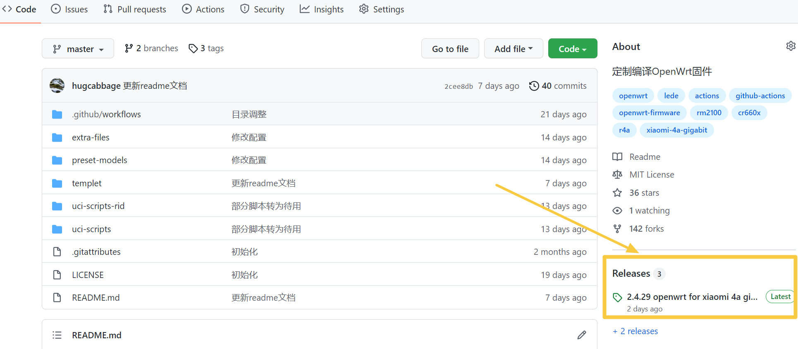
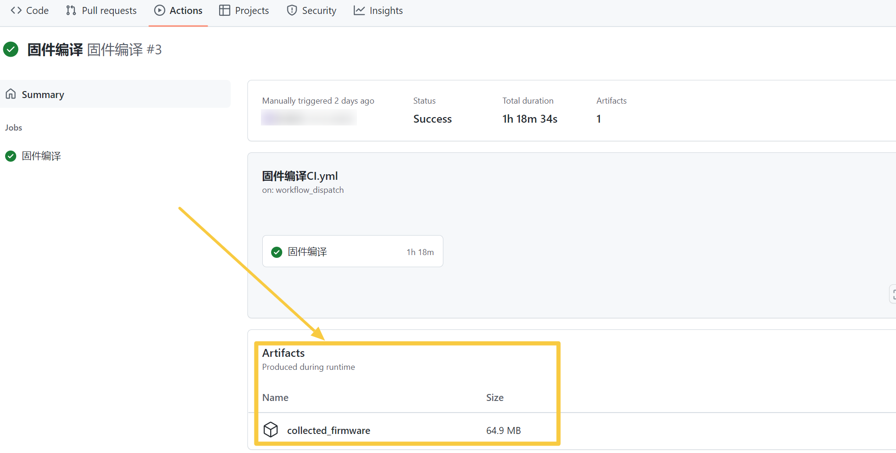

# 使用 GitHub Actions 快速定制编译 OpenWrt 固件

流程文档参考[KFERMercer/OpenWrt-CI](https://github.com/KFERMercer/OpenWrt-CI)，十分感谢！

预置机型有小米4A千兆版、小米3Gv2、小米CR6606、小米CR6608、小米CR6609、红米AC2100、小米AC2100、小米4、小米3G、小米3Pro、斐讯K2P。

默认编译第一个，即小米4A千兆版。如需要其他机型，在运行workflow界面点开`选择机型`的下拉框，即可手动选择其他机型。

需要其他机型可参考以上，并修改templet目录下的各文件，以作新增机型，[使用教程](templet/instruction.md)。

喜欢的话，Star一下，方便再找。

## 使用本项目你需要:

- GitHub 账号

- GitHub Actions 基本使用技能

#### 若要高度定制固件，需要掌握一定的Liunx、OpenWrt、[Actions](https://docs.github.com/cn/actions)等相关知识，途径：自行搜索学习

## 使用教程:

### 1. 注册GitHub账号并开启GitHub Actions

### 2. fork [hugcabbage/shared-lede](https://github.com/hugcabbage/shared-lede)

### 3. 设置Actions secrets

只上传到artifact，可以跳过此步。

进入GitHub Settings(点头像) → Developer settings → Personal access tokens → Generate new token，Note随意填，Expiration建议选`No expiration`，Select scopes里勾选`repo`、`workflow`，点Generate token，复制下长串token。

进入你fork的项目shared-lede下，点Settings → Secrets → Actions → New repository secret，Name填`RELEASE_FIRMWARE`，Value填复制的token，点Add secret。

### 4. 自定义固件

什么也不修改，按默认配置，可以跳过此步。

以小米4A千兆版为例，主要修改四个文件，在preset-models目录中。

> 1clone.sh

固件源码和插件源码，新增插件源时，建议先在本地测试下是否缺依赖。

常用的克隆命令如下（克隆理解为下载即可）：

`git clone 链接`

`git clone -b 分支名 链接`

> 1modify.sh

固件初始化设置，修改登录IP、主机名、WiFi名称等。

此脚本用到最多的命令是sed，详细用法参见[链接](https://www.runoob.com/linux/linux-comm-sed.html)，这里只简单说明。

比如，下面这条命令就是用来修改管理IP的：

`sed -i 's/192.168.1.1/192.168.31.1/g' package/base-files/files/bin/config_generate`

`192.168.1.1`是源码中默认的lan口登录IP，也即初始的；`192.168.31.1`是新的，用来替换初始文本的。

可以看出命令的构成是这样的：

`sed -i 's/原字符串/新字符串/g' 文件路径`

这就可以用来替换掉源码中的特定位置，-i指直接改动文件，s指替换，g指全局。

原字符串记为str1，新字符串记为str2，自定义设置改动str2位置即可，如果你改动了str1，那么命令在源码中就匹配不到东西了，替换也就无效了。

🎈🎈🎈 引用

各基础命令的用法可参考该[链接](https://github.com/danshui-git/shuoming/blob/master/ming.md)，个人觉得写得很详细，非常适合新手看。当然该作者仓库内还有其他详细的教程，有兴趣的自行查阅。

> 1.config

只带luci应用、theme这两部分，流程中会转为.config，并自动补全为完整的。

增减插件修改这个文件即可，以argon主题为例，格式如下：

 `CONFIG_PACKAGE_luci-theme-argon=y`   选中编译进固件的是这种

 `CONFIG_PACKAGE_luci-theme-argon=m`   选中仅编译ipk插件是这种

 `# CONFIG_PACKAGE_luci-theme-argon is not set`  未选中是这种

> release_content.txt

此文本仅作release记录，其中的IP、密码与固件并无关联，怎么改都可以，不修改也可以。

### 5. Actions中手动开始编译流程

选择你的`Workflow`，点击Run workflow，按需填内容，运行即可。

各选项说明如下:

> 超频到1100Mhz: 

默认不勾选。仅适用于5.10内核，所有预置机型默认皆为5.10内核。

> 使用5.15内核: 

默认不勾选。目前仅适用于lienol源码的机型，除小米4A千兆版和小米3Gv2外，其余都是lienol源码。

lean lede源码中package/lean/mtk-eip93编译会报错，勿用。

> 选择机型: 

默认为小米4A千兆版。点开下拉框，可以选择不同的机型。

> 上传到release: 

默认勾选。推荐，空间无限，单文件不能超过2GB，有内容记录。 release区见下图：

</img>

> 上传到artifact: 

默认不勾选。不推荐，无内容记录。 artifact区见下图：

</img>

> 版本描述: 

可作一些简单记录，会在release中显示。

### 6. 编译完成

Actions流程顺利完成后，去release(或者artifact)下载你的固件，allfiles.zip是所有文件的打包。

## 各机型对应文件说明

|机型|文件|
|:----:|:----:|
|小米4A千兆版 小米3Gv2|1.config、1clone.sh、1modify.sh|
|小米4 小米3G 小米CR6606 小米CR6608 小米CR6609 小米3Pro|2.config、2clone.sh、2modify.sh|
|红米AC2100 小米AC2100|3.config、3clone.sh、3modify.sh|
|斐讯K2P|4.config、4clone.sh、4modify.sh|

## 提示

1.直接在Actions中运行`固件编译`就能编译出固件，但默认插件数量较少，对插件有增、减需要的，到`[数字].config`中自行选择。若在`[数字]clone.sh`中添加了插件源，在`[数字].config`要作对应修改，建议先在本地make menuconfig测试。

2.超频方案默认不启用，方案来自该[帖子](https://www.right.com.cn/forum/thread-4042045-1-1.html)。

3.小米4A千兆版和小米3Gv2需修改分区才能在breed直刷，参考该[帖子](https://www.right.com.cn/forum/thread-4052254-1-1.html)，本项目中已修改好。

4.小米4A千兆版和小米3Gv2闪存小，若编译插件太多，包体积超出16064K，则不会生成sysupgrade.bin。

可以去[官方插件库](https://downloads.openwrt.org/snapshots/packages/mips_24kc/packages/)参考各插件大小，下方也列出了几个较大插件的最近版本的体积:

UnblockNeteaseMusic-Go_0.2.13 --- 2.05MB 
luci-app-openclash_0.44.16 --- 2.14MB 
luci-app-vssr_1.23 --- 2.87MB 
xray-core_1.5.3 --- 5.63MB 

---

## 最后

不准备出什么详细的教程，自己摸索吧。

如有问题，请利用庞大的网络知识库，能快速解决你的问题。
