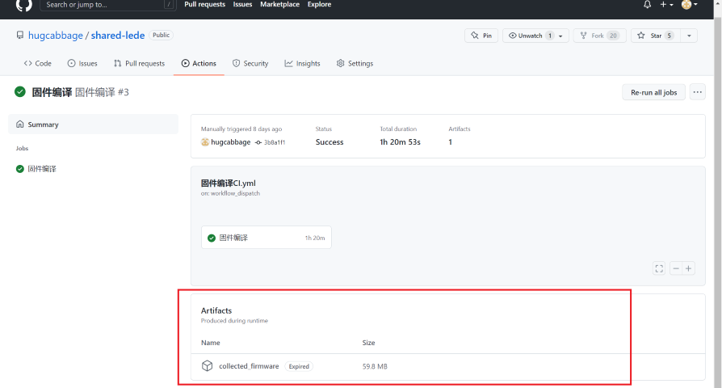
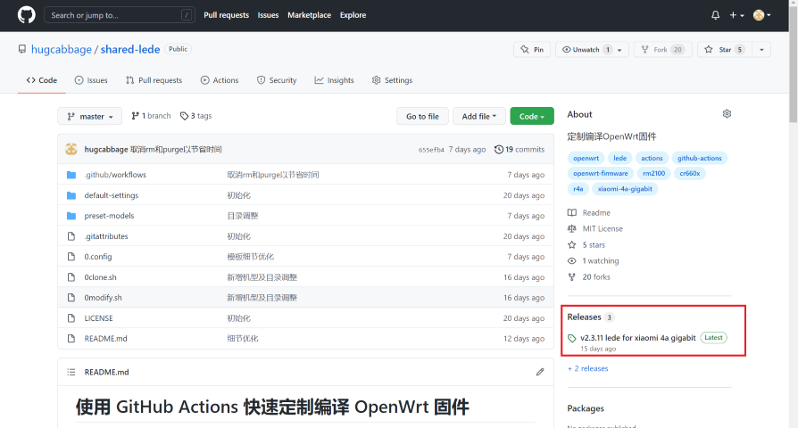

# 使用模板添加机型

模板文件皆放置于templet目录下。

## 使用教程:

### 1. 设置Actions secrets

只上传到artifact，可以跳过此步。

进入GitHub Settings(点头像) → Developer settings → Personal access tokens → Generate new token。

Note随意填，Expiration建议选`No expiration`，Select scopes里勾选`repo`、`workflow`，点Generate token，复制下长串token。

进入你fork的项目shared-lede下，点Settings → Secrets → Actions → New repository secret，Name填`RELEASE_FIRMWARE`，Value填复制的token，点Add secret。

### 2. 自定义固件

修改templet目录内各文件是新增机型的关键步骤，各文件说明如下：

> `0clone.sh`

该脚本用于下载固件源码和插件源码，可参照预置机型修改。新增插件源时，建议先在本地测试下是否缺依赖。

注意：

Actions流程运行时，默认工作目录是$GITHUB_WORKSPACE。

为了方便，一般将克隆的固件源码放在$GITHUB_WORKSPACE里，比如克隆了lede源码，将lede目录内的所有文件移动到上一层目录，即不要lede这个目录。

> `0modify.sh`

该脚本用于固件初始化设置，修改登录IP、主机名、WiFi名称等，可参照预置机型修改。

> `0.config`

该文件作为.config的前置文件，流程中会转为.config。

获得此文件的一般方法是：

先按照本地编译固件的步骤，make menuconfig这一步完成后，本地就已生成.config，然后复制其中的内容到0.config即可。

建议只复制luci应用、theme这两部分，因为流程中会自动补全为完整的，简洁的文本方便后续修改。

以argon主题为例，格式如下：

"CONFIG_PACKAGE_luci-theme-argon=y"   选中编译进固件的是这种

"CONFIG_PACKAGE_luci-theme-argon=m"   选中仅编译ipk插件是这种

"# CONFIG_PACKAGE_luci-theme-argon is not set"  未选中是这种

> `0buildCI.yml`

该文件为Actions流程文档，文档中******标注的地方，即是最少的修改。语法详见[官方文档](https://docs.github.com/cn/actions)。

这里对部分地方作说明：

* on.workflow_dispatch   手动运行工作流程

* jobs.change-ver   这部分job用于更新版本号

* jobs.build_openwrt   这部分job用于编译固件

* runs-on: ubuntu-latest   运行于ubuntu

* name: Checkout 
  uses: actions/checkout@v3

克隆本仓库的全部文件到流程的工作空间内，即$GITHUB_WORKSPACE。

uses字样指使用了Github Marketplace的应用，可以大幅度简化流程。本流程中如上传release、上传artifact，都使用了Marketplace中的应用。

* 0clone.sh、0modify.sh、0.config

带这些字样的地方代表使用仓库中根目录的这些文件，./0clone.sh代表执行脚本。

若这些文件的目录有变动，必须在流程文档作出相应修改，比如templet/0clone.sh。

* zip -r ./allfiles.zip ./*  
  zip -r ../packages.zip ./*

默认采用zip压缩方式，allfiles所有文件的压缩包，packages是全部ipk插件的压缩包。

* repo_token: ${{ secrets.RELEASE_FIRMWARE }}

与你第1步设置的secrets对应，是成功上传文件到release的关键。

* tag: ${{ needs.change-ver.outputs.output-ver }}

使用jobs.change-ver的指定输出作为tag名称，也即更新后的版本号，像1.0.0这种。

* name: 上传固件到artifact 
  if: github.event.inputs.artifact == 'true' || steps.upload-release.conclusion == 'skipped'

if语句的作用：手动选择了上传artifact，或者当跳过上传release时，就会把编译好的文件打包上传到artifact。

有些时候可能会因为上传release失败，而你又只选择了这种方式输出编译包，那么你等于白编译了，所以将上传artifact作为前者失败时的备份方式输出编译包。

> `version.txt`

该文本记录版本号，初始为0.0.0，不需要手动修改，每次运行编译流程会自动更新。

版本号主要用作上传release时创建tag，因为tag不能重复，设为自动更新更省事。

版本号范围0.0.0 - 0.0.9 - 0.1.0 - 0.9.9 - 1.0.0 - 9.9.9 - 10.0.0。

> `update-version.py`

用于自动更新版本号，无须修改。

### 3. 移动文件

修改文件后，需移动0buildCI.yml到.github/workflows下，其余文件移动到根目录下。

### 4. Actions中手动开始编译流程

选择你的`Workflow`，点击Run workflow，按需填内容，运行即可。

### 5. 编译完成

Actions流程顺利完成后，去release(或者artifact)下载你的固件，allfiles.zip是所有文件的打包。

artifact区如下图所示：

release区如下图所示：

